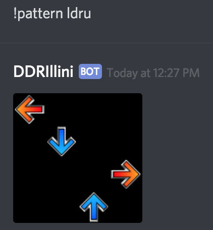

Currently, it has two features:



You can download this and run it yourself. Be wary it's pretty
hacky.

We're currently in the midst of the semester, but we might publish this bot
eventually so that anyone can just add it to their own server. Watch this
repo to be notified (we'd make a release).

# Node.js
```
# install nodejs
curl -sL https://deb.nodesource.com/setup_8.x | sudo -E bash -
sudo apt-get install -y nodejs

# install dependencies
npm install discord.io winston moment

# run bot (probably want to do this inside a tmux window on a server.)
# you could use a proper process manager but /shrug
node bot.js
```
# Python 3.7
```
# install dependencies
python3 -m pip install -U discord.py arrow Pillow

# run bot
python3 bot.py --login_token <YOUR_TOKEN>
```

